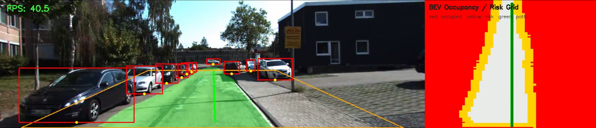
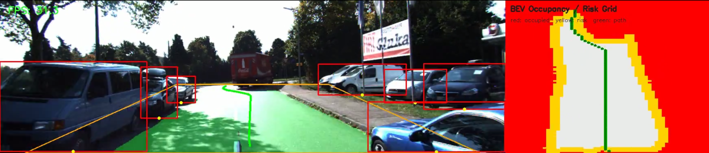
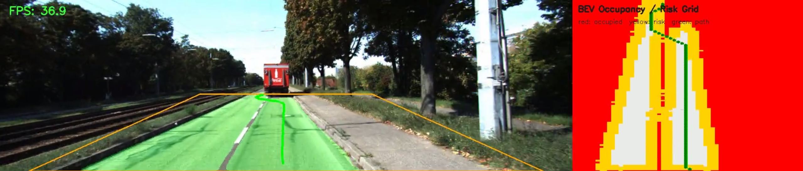
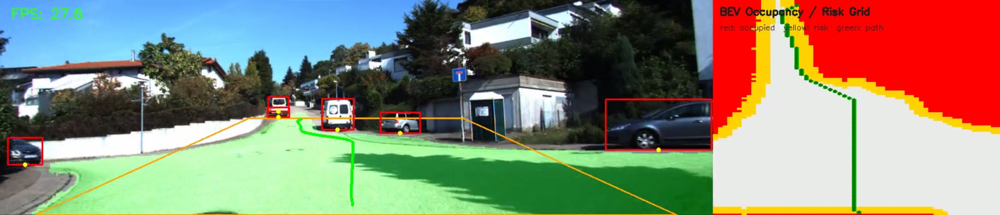

# MonoDrive-BEV 🚗👁️

**MonoDrive-BEV** is a Computer Vision prototype that performs **Monocular 3D Perception, Sensor Fusion, and Path Planning** using a single standard camera. It translates 2D dashboard camera feeds into a top-down Bird's Eye View (BEV) Occupancy Grid and dynamically calculates a safe trajectory.

## 📸 Sample Screenshots

Here are some examples of the Sensor Fusion and A* Path Planning in action:






## 🚀 Features

- **Dynamic Obstacle Detection:** Uses `YOLOv8` to detect vehicles, pedestrians, and other obstacles in the camera view.
- **Drivable Area Segmentation:** Uses `TwinLiteNetPlus` to achieve pixel-perfect segmentation of the drivable road surface.
- **Fixed Inverse Perspective Mapping (IPM):** A mathematically robust transformation matrix projects the 2D visual data into a top-down 3D space.
- **Sensor / Model Fusion:** Fuses the Non-Drivable Area (static environment) with YOLO bounding boxes (dynamic obstacles) using a simple logical `OR` operation on the Occupancy Grid.
- **A* Path Planning:** Real-time trajectory generation that intelligently navigates around vehicles and stays strictly within the road boundaries.

## 🛠️ How it Works

1. **Perception**: The frame is passed through two separate neural networks. YOLO finds the cars, while TwinLiteNet finds the asphalt.
2. **BEV Transformation**: The drivable area mask is warped into a top-down grid using a fixed perspective transform based on the camera's assumed position.
3. **Cost Map Generation**: YOLO's object "contact points" are projected into the same grid. Obstacles are inflated (risk radius) to ensure safety margins.
4. **Planning**: The A* algorithm searches for the optimal path from the bottom-center of the grid (ego-vehicle) to the furthest reachable point on the road.

## 💻 Running the Demo

```bash
# Create a virtual environment and install requirements
python3 -m venv .venv
source .venv/bin/activate
pip install -r requirements.txt
pip install onnxruntime-gpu # If using ONNX weights

# Run the planning demo
python3 src/run_planning_demo.py \
    --model yolov8n-seg.pt \
    --device cuda:0 \
    --output outputs/planning_demo_with_fusion.mp4 \
    --video data/kitti_drive_0059_image02.mp4
```

> Note: Make sure you have the pre-trained TwinLiteNet weights available in your path (currently configured for `Weights/TwinLiteNetPlus/large.pth`).
